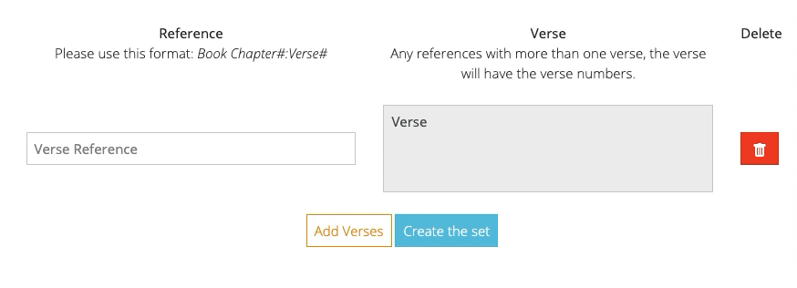
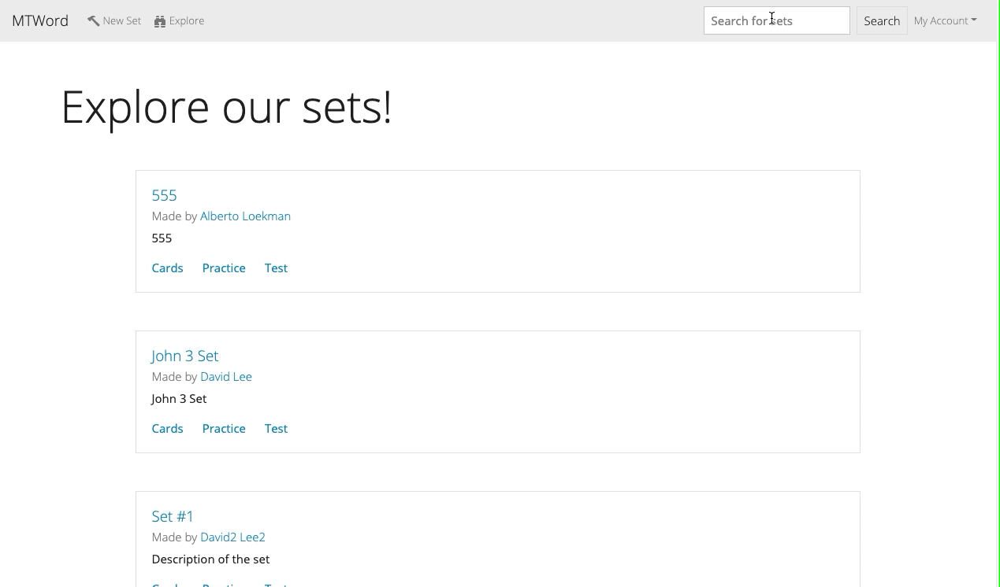

# MTWord (Memorize the Word)
<!-- A little info about your project and/ or overview that explains **what** the project is about. -->
MTWord stands for Memorize the Word and is a [Quizlet](https://quizlet.com/) clone 
but for Bible verses (using the [ESV](https://www.esv.org/) [English Standard Version])

## Motivation
<!-- A short description of the motivation behind the creation and maintenance of the project. This should explain **why** the project exists. -->
After a conversation with one of my friends, we realized how difficult 
it is to memorize Bible verses. I wanted to try to build something to aid 
making Bible verse sets and memorizing different verses. When making 
specific Quizlet sets for many verses, it can be tedious to individually 
make cards for a passage. This application seeks to address that struggle 
with allowing user to easily create many cards from one long passage reference.

<!-- ## Build status
Build status of continus integration i.e. travis, appveyor etc. Ex. - 

[](https://travis-ci.org/akashnimare/foco)
[](https://ci.appveyor.com/project/akashnimare/foco/branch/master)

## Code style
If you're using any code style like xo, standard etc. That will help others while contributing to your project. Ex. -

[](https://github.com/feross/standard)
 
## Screenshots
Include logo/demo screenshot etc. -->

## Tech/framework used

### Built with
<b>Backend:</b>
- [Flask](https://flask.palletsprojects.com/en/1.1.x/)
    * [Flask-Admin](https://flask-admin.readthedocs.io/en/latest/)
    * [Flask-Bcrypt](https://flask-bcrypt.readthedocs.io/en/latest/)
    * [Flask-Bootstrap](https://pythonhosted.org/Flask-Bootstrap/)
    * [Flask-Mail](https://pythonhosted.org/Flask-Mail/)
    * [Flask-SQLAlchemy](https://flask-sqlalchemy.palletsprojects.com/en/2.x/)
    * [Flask-WTF](https://flask-wtf.readthedocs.io/en/stable/)
- [Elasticsearch](https://www.elastic.co/guide/index.html)
    * Elasticsearch was used to index the sets by their name and description in order to easily search for different sets

<b>Frontend:</b>
- [jQuery](https://jquery.com/)
- [Lodash](https://lodash.com/)
    * Used to debounce API call necessary to get the verse from
- [Axios](https://github.com/axios/axios)
    * Used to make AJAX requests


## Features
1. Auto-populate and Auto-correct implemented through using the ESV API


<br/>
<br/>

2. Searching through set names and set descriptions through Elasticsearch


<br/>
<br/>

3. Admin page accessible for the admin users to edit any of the users, sets, verses models


<br/>
<br/>

## Profiling the performance improvements of using Elasticsearch
In order to measure the amount of time between searching through the database to find 
our sets, the [Python Profiler](https://docs.python.org/2/library/profile.html) 
package was used in addition to [Faker](https://faker.readthedocs.io/en/stable/index.html)
package in order to generate large amounts of set data. 

Here below are the results of making different amount of queries across different number of sets in the database. The results can be averaged out in order to give a representation of
the improvements made through implementing Elasticsearch. 

## How to use?
In order to host the project locally, follow these steps
```code
git clone https://github.com/d-lee84/MTWord.git
cd MTWord
python3 -m venv venv
pip3 install -r requirements.txt
flask run
```
Some features may not work locally because of API keys that are not available.

## Future directions
- Tests: Definitely want to make sure that all of my code is tested. 
    Currently there is a problem running the tests because of an 
    application context problem. 
- Helpful memorization features: Card matching, text matching, quiz features for the memorization aspect
- Incorporating OAuth using [Flask-Dance](https://flask-dance.readthedocs.io/en/latest/)
- Ordering the sets by different factors such as name, created date, number of cards, etc...
- Reset password feature using JWTs [Flask-JWT-extended](https://flask-jwt-extended.readthedocs.io/en/stable/)
- Add a feature for someone to demo without loggin in

<!-- 

## Code Example
Show what the library does as concisely as possible, developers should be able to figure out **how** your project solves their problem by looking at the code example. Make sure the API you are showing off is obvious, and that your code is short and concise.

## Installation
Provide step by step series of examples and explanations about how to get a development env running.

## API Reference

Depending on the size of the project, if it is small and simple enough the reference docs can be added to the README. For medium size to larger projects it is important to at least provide a link to where the API reference docs live.

## Tests
Describe and show how to run the tests with code examples.

## Contribute

Let people know how they can contribute into your project. A [contributing guideline](https://github.com/zulip/zulip-electron/blob/master/CONTRIBUTING.md) will be a big plus.

## Credits
Give proper credits. This could be a link to any repo which inspired you to build this project, any blogposts or links to people who contrbuted in this project. 

#### Anything else that seems useful

## License
A short snippet describing the license (MIT, Apache etc)

MIT © [Yourname]() -->